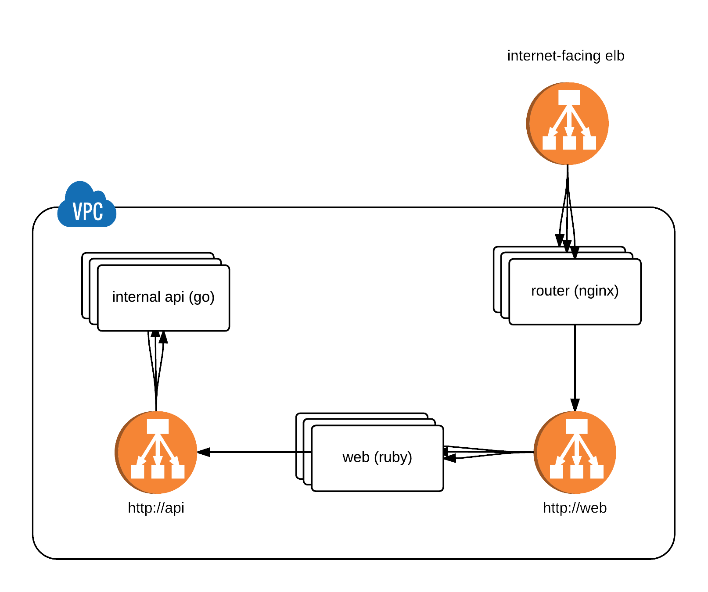

# Empire Demo

This is a set of applications to demo the following architecture in an Empire environment:

* Public router app.
* Routes to an internal frontend app.
* Frontend app talks to an internal API.



## Local

To run this environment locally:

```
docker-compose up
```

Then open the web client in your browser:

```
open "http://$(boot2docker ip):8080"
```

## Remote

To run this in an Empire environment:

1. Ensure you have a new empty Empire environment setup. Refer to the [installation guide](http://empire.readthedocs.org/en/latest/installing/).
2. Ensure that you have the `emp` CLI installed and the `EMPIRE_API_URL` environment variable set.
3. Run the following:

   ```console
   $ deploy
   ```
